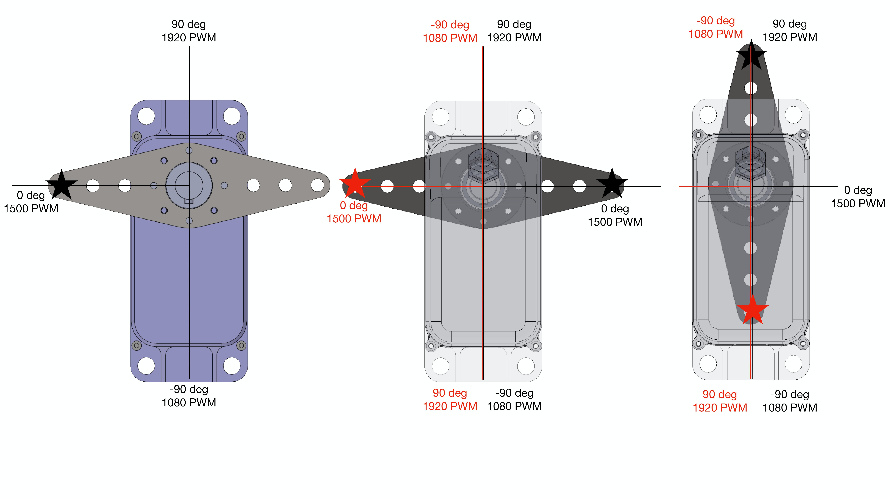
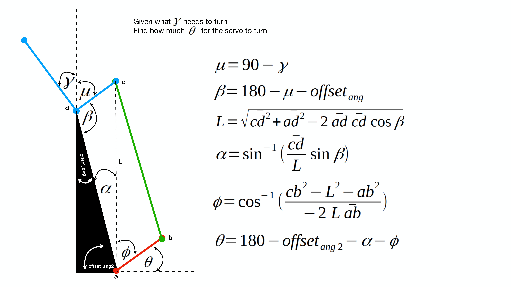

# ATCart-Omni

This is a script to control ATCart-Omni 

## Dependencis

[jmoab-ros](https://github.com/rasheeddo/jmoab-ros)

## Hardware

- Actual full assemble cart

- Jetson Nano

- JMOAB board

- Futaba radio transmitter and receiver

- PCA9685 servo driver

## Simulation (optional)

If you don't have the physical cart, you can try out the control algorithms on Gazebo model with gamepad, please check on the [atcart_omni_gazebo](https://github.com/rasheeddo/atcart_omni_gazebo) repo.

## Mathematics and Setup

There are 5 modes which we can control on this cart

- Left diagonal

- Right diagonal

- Skidding

- Sided-way 

- Double-Ankermann steering


Our servo motor can be driven 180deg ranges with the general PWM ranges (1080-1500-1920). Each of servo motor is attached to the push rod with different servo's horn position, so the drive angle has to be input carefully.



The wheel angle and servo angle is not proportionally linear, because it's connected together as the four-bar linkage, so from the desired wheel's angle we can calculate the servo angle from equation belows.





Currently, we need to flash a custom FW on JMOAB as [20220622_JMOAB06_v08a_omni-atcart.hex](https://github.com/rasheeddo/jmoab-ros/tree/master/firmwares).

### Servo PCA9685

Front-left-servo is at CH0 of PCA9685

Front-right-servo is at CH1 of PCA9685

Rear-left-servo is at CH2 of PCA9685

Rear-right-servo is at CH3 of PCA9685

### Futaba Transmitter

Ch10 as volume-knob is for mode changing

To control, we need to put JMOAB in auto-mode, (ch5 is high).


## Run

This command below assumes to run on Jetson Nano.

```sh
## Terminal1
roscore

## Terminal2
rosrun jmoab-ros jmoab-ros-atcart-omni.py

## Terminal3
rosrun jmoab-ros jmoab-ros-pca9685.py

## Terminal4
cd ~/atcart_omni
python cart_control.py

```
